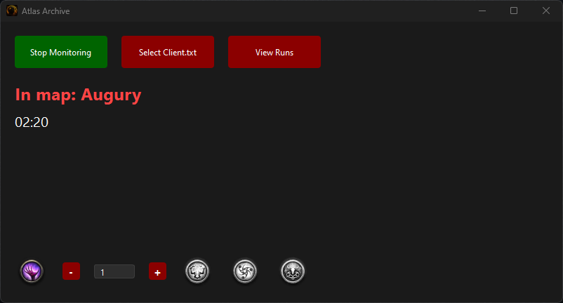
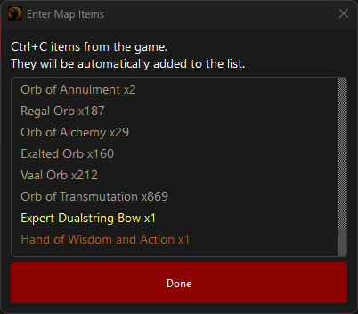
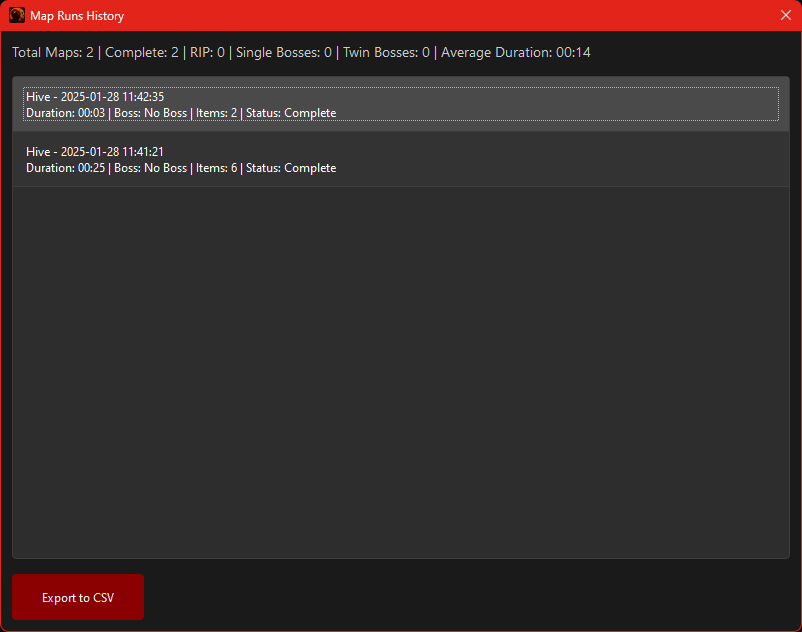
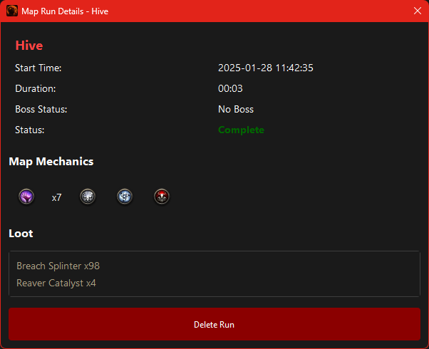

# Atlas Archive

A PyQt6-based application for tracking Path of Exile 2 map runs, including time spent, boss kills, loot obtained, and endgame mechanics.



## Project Structure

```
atlas-archive/
├── build/                # Build configuration
│   └── build.py         # PyInstaller build script
├── releases/            # Compiled releases
├── src/
│   ├── dialogs/         # UI dialog components
│   │   ├── __init__.py
│   │   ├── boss_kill_dialog.py
│   │   ├── item_entry_dialog.py
│   │   ├── map_completion_dialog.py
│   │   ├── map_run_details_dialog.py
│   │   └── map_runs_dialog.py
│   ├── images/          # UI assets
│   │   └── endgame-mech/  # Mechanic icons
│   │       ├── breach.png
│   │       ├── breach_off.png
│   │       ├── delirium.png
│   │       ├── delirium_off.png
│   │       ├── expedition.png
│   │       ├── expedition_off.png
│   │       ├── ritual.png
│   │       └── ritual_off.png
│   └── utils/           # Utility modules
│       ├── __init__.py
│       ├── database.py  # SQLite database handling
│       ├── item_parser.py # Item clipboard parsing
│       ├── log_parser.py  # Client.txt log parsing
│       ├── resource_path.py # Resource path resolution
│       └── test_parser.py  # Parser tests
├── main.py             # Application entry point
├── settings.json       # User settings
└── README.md
```

## Features

- Track map run duration with automatic pause detection
- Record boss kills (including twin bosses)
- Log items found (via clipboard)
- Track endgame mechanics:
  - Breach (with counter)
  - Delirium
  - Expedition
  - Ritual
- View detailed run history
- Export data to CSV
- Dark mode UI
- Automatic map detection via Client.txt monitoring
- Pause/resume tracking when entering hideout

## Requirements

- Python 3.x
- PyQt6
- PyInstaller (for building executable)

## Installation

### From Source
1. Clone the repository
2. Install dependencies:
```bash
pip install PyQt6 PyInstaller
```

### From Release
Download the latest release from the releases folder and run the executable directly.

## Usage

1. Run the application:
```bash
Atlas Archive.exe 
```
OR
```bash
python main.py
```

2. Click "Select Client.txt" to choose your Path of Exile 2 Client.txt file
3. Click "Start Monitoring" to begin tracking map runs
4. During a map run:
   - Track mechanics by clicking their icons at the bottom
   - For Breach encounters, use +/- buttons to track count
   - Map timer automatically pauses when entering hideout
5. End a map run:
   - Automatically ends when entering a new map/area
   - Can manually end using "End Map" button when paused
   - Select completion status (Complete/RIP)
   - For maps with bosses:
     - On completion: Select if it was a twin boss
6. After a map:
   - Use "Log Items" to record items from your clipboard



   - View run history with the "View Runs" button




## Database Schema

The application uses SQLite to store map run data in `poe2_maps.db`. The schema includes:

### map_runs table
- id (PRIMARY KEY)
- map_name (TEXT)
- boss_count (INTEGER) - 0: No boss, 1: Single boss, 2: Twin boss
- start_time (TIMESTAMP)
- duration (INTEGER) - in seconds
- items (TEXT) - JSON array of items found
- value (REAL) - Reserved for future use
- completion_status (TEXT) - 'complete' or 'rip'
- has_breach (BOOLEAN)
- has_delirium (BOOLEAN)
- has_expedition (BOOLEAN)
- has_ritual (BOOLEAN)
- breach_count (INTEGER)
